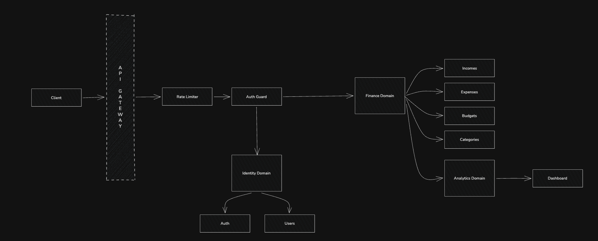
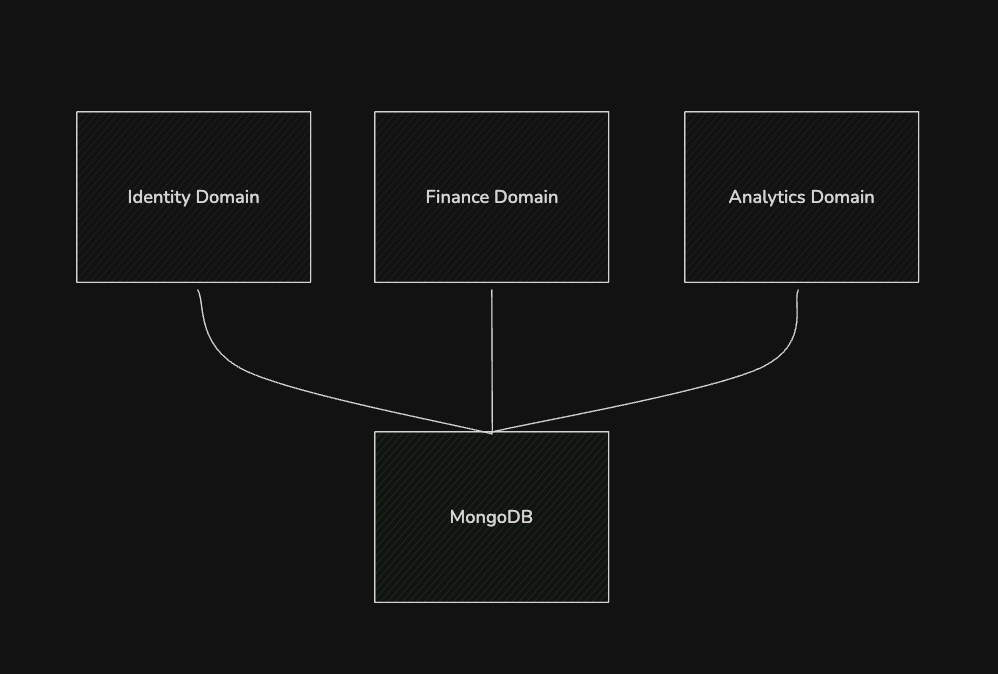

# Personal Finance Tracker API

## Introduction

Personal Finance Tracker API is a backend application built with NestJS and MongoDB that helps users manage their personal finances efficiently. The system allows users to track incomes, expenses, budgets, and categories while providing analytical insights through a dedicated dashboard module.

The project focuses on clean API design, scalable architecture, secure authentication, and efficient financial reporting using MongoDB Aggregation Pipelines.

---

## Architecture

The application follows a **Modular Monolith Architecture** with a **Domain-Driven Design** approach. Features are grouped into independent business domains while remaining part of a single deployable NestJS application.

### Feature Domains

#### Identity Domain

Responsible for user authentication and account management.

* Auth
* Users

#### Finance Domain

Responsible for all financial operations.

* Incomes
* Expenses
* Budgets
* Categories

#### Analytics Domain

Responsible for generating insights and reports from financial data.

* Dashboard

### Request Flow

Client → API Gateway → Rate Limiter → Auth Guard → Domain Modules → MongoDB

This architecture provides clear separation of concerns, maintainability, and the ability to scale individual domains as the application grows.

---

## Tech Stack

| Technology      | Purpose                        |
| --------------- | ------------------------------ |
| NestJS          | Backend Framework              |
| TypeScript      | Type Safety & Maintainability  |
| MongoDB         | Primary Database               |
| Mongoose        | ODM for MongoDB                |
| JWT             | Authentication & Authorization |
| Swagger         | API Documentation              |
| Class Validator | Request Validation             |
| Rate Limiter    | API Protection & Security      |

### Why MongoDB?

MongoDB provides a flexible document-based database structure and a powerful Aggregation Framework, making it well-suited for financial reporting, dashboard analytics, filtering, and search operations.

### Why JWT?

JWT enables secure and stateless authentication, allowing protected routes to verify user identity without maintaining server-side sessions.